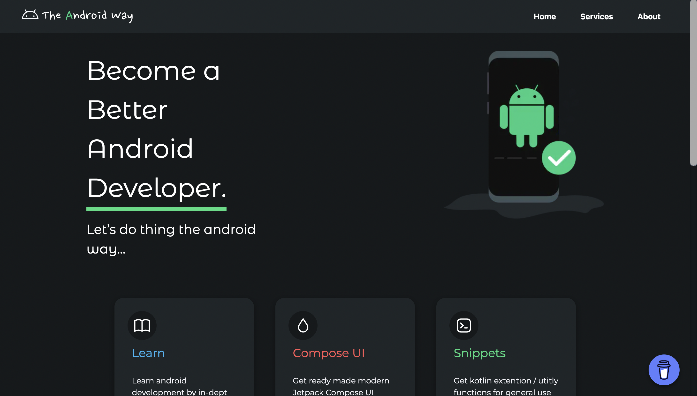
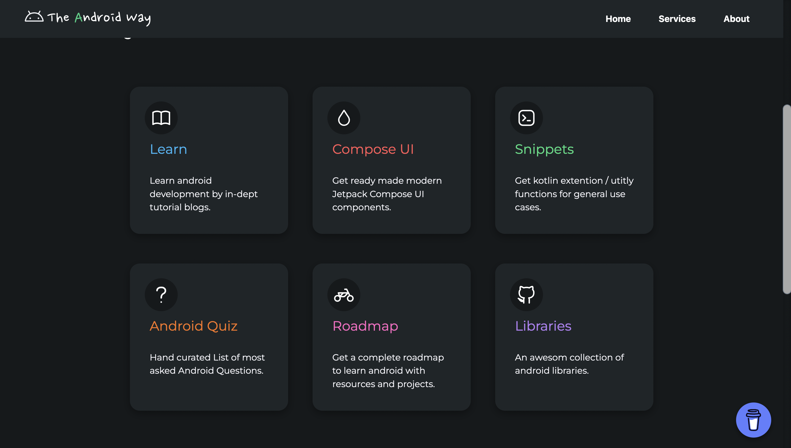
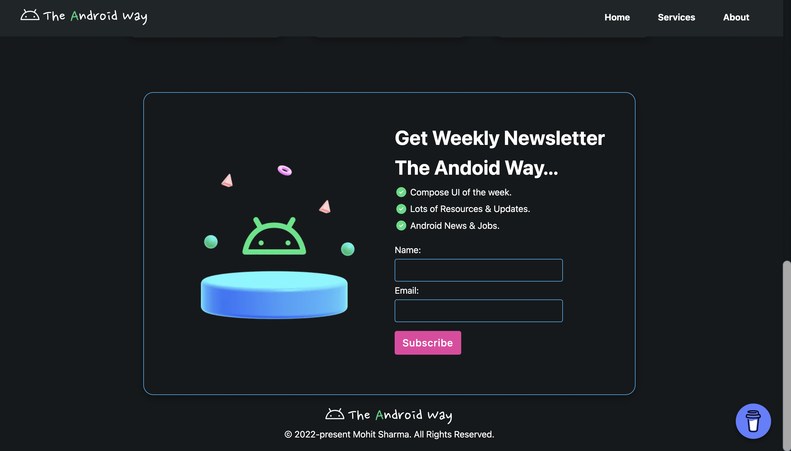
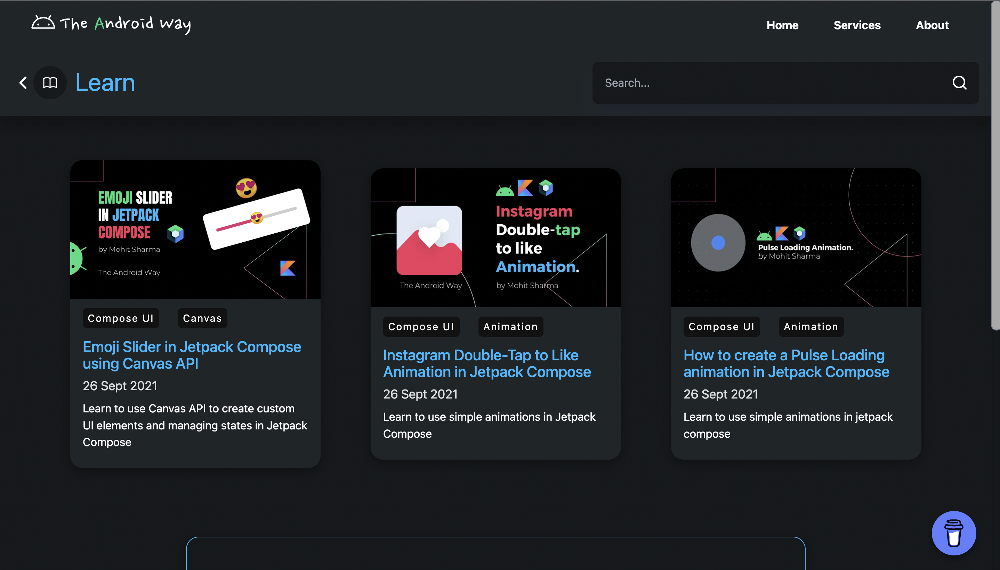
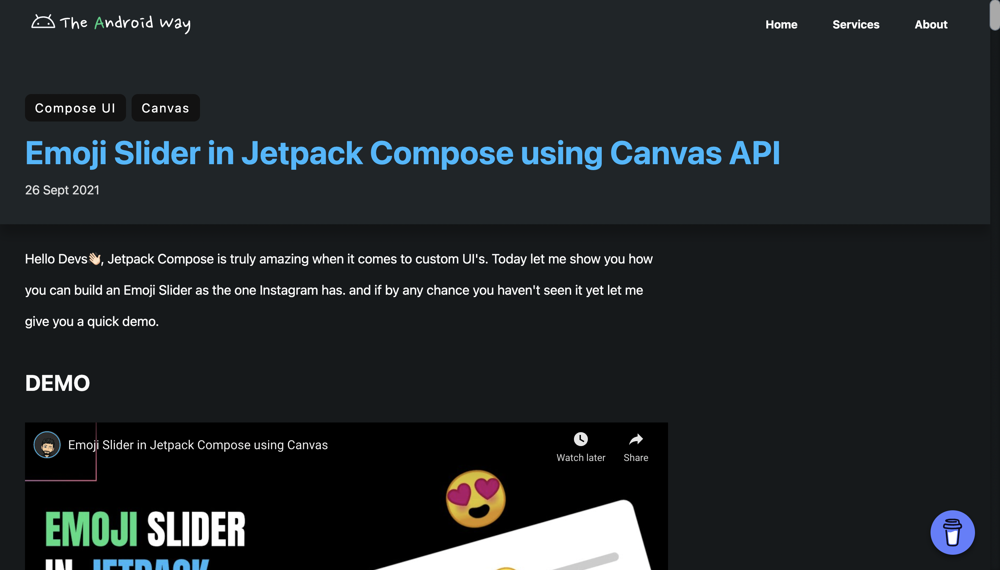
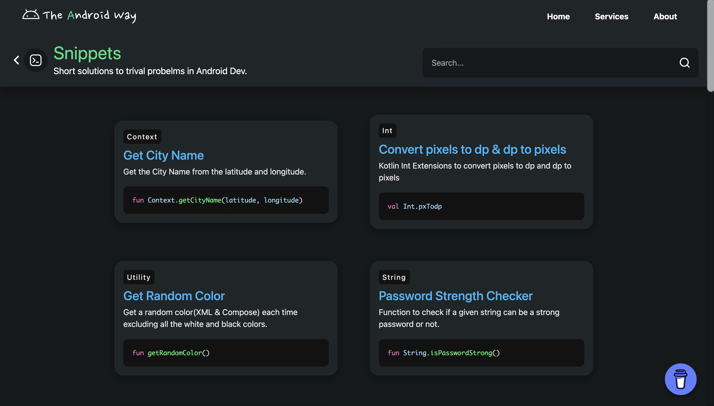

# [The Android Way](https://the-android-way.vercel.app/)

The aim is to create an website for android developers to provide them with high quality knowledge of android development with latest trends.

### Features

* Blog based Learning.
* Android Code Snippets. 
* Compose UI. 
* NewsLetter to get updated on latest trends.
* Android Developer RoadMap. [Coming Soon]
* Android Interview Questions. [Coming Soon]
* Useful Android Libraries. [Coming Soon]

### Preview
 

### [Live Link](https://the-android-way.vercel.app/)

### Tech Stack
* Next.js
* SASS
* Javascript
* HTML
* MDX

